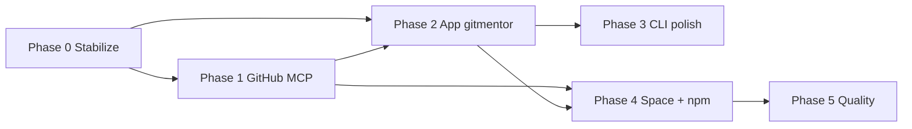

# git-mentor — Roadmap

Evidence-backed GitHub career intelligence. This document sequences work from the current **v0.1** monorepo toward a stable product: CLI, MCP, browser app, and public demo.

**Current baseline (done):**

| Surface | Location | Notes |
|---------|----------|--------|
| CLI + Ink chat | `packages/cli` | Primary UX; slash commands, model picker, GitHub auth |
| Chat engine | `packages/chat` | Sessions, prompts, GitHub MCP wiring |
| Agents / analysis | `packages/agents` | Profile, repo scans, coaching pipeline |
| GitHub + MCP | `packages/github` | `gh` auth, bundled GitHub MCP server |
| LLM | `packages/llm` | Ollama, OpenRouter, model config |
| Core config | `packages/core` | `~/.config/git-mentor`, rules, skills |
| Minimal browser UI | `packages/chat/src/server.ts` | `gitmentor app` → localhost:3847, embedded HTML |
| HF demo | `apps/space` | Docker Space, public profile analysis |
| npm global | root `package.json` | `gitmentor` / `git-mentor` binaries |

---

## Vision

One coaching brain (`@git-mentor/chat` + `@git-mentor/agents`) exposed through:

1. **Terminal** — fast, local-first, power users  
2. **App** — approachable UI for reports, history, and GitHub actions  
3. **MCP** — Cursor / IDE agents with the same tools and evidence rules  
4. **Space** — zero-install demo; upsell to CLI or app  

All surfaces share config, cache (`~/.local/share/git-mentor/reports/`), rules/skills, and deterministic slash commands where possible.

---

## Phase 0 — Stabilize foundation (short)

**Goal:** Safe to ship `0.2.x` on npm and document the public contract.

- [ ] Raise eval pass rate (`gitmentor eval`) to ≥ 80% consistently; add regression cases for profile vs repo analysis boundaries  
- [ ] Publish checklist: `pnpm build`, `pnpm test`, global install smoke (`gitmentor doctor`, `gitmentor octocat --deterministic`)  
- [ ] Align README with actual MCP tool list (built-in vs `github` server)  
- [ ] Versioning policy: semver for `@git-mentor/*` workspace packages when publishing internally  

**Exit criteria:** CI green on main; npm install path documented and verified.

---

## Phase 1 — GitHub MCP completeness

**Goal:** Chat and MCP can execute growth actions without sending users to the GitHub UI.

Planned tools (see `packages/cli/templates/agent/mcp/tools.md`):

- [ ] `search_repositories`  
- [ ] `create_repository`  
- [ ] `create_issue`  
- [ ] `create_pull_request`  
- [ ] `push_files`  
- [ ] `create_branch`  

**Already shipped:** `fork_repository`, `follow_user` (with `user` scope / `/auth refresh`).

**Tasks:**

- [ ] Implement missing tools in `packages/github/src/mcp-github-server.ts` with scope checks and clear errors  
- [ ] Update `github-mcp-actions` skill and `tools.md` when each tool lands  
- [ ] Chat shortcuts: document and test `/mcp call github …` paths for new tools  

**Exit criteria:** Skills no longer label tools as “roadmap”; eval or integration tests cover fork + follow + at least search + create_issue.

---

## Phase 2 — App gitmentor (`apps/gitmentor`)

**Goal:** Replace the embedded HTML prototype with a first-class web client that reuses `@git-mentor/chat` and matches CLI capabilities.

### 2.1 Architecture

```
apps/gitmentor/          # Vite or Next.js SPA + API routes (or thin BFF)
  └── talks to           @git-mentor/chat (session API)
                         @git-mentor/core (config)
                         optional: same HTTP server as today, extended routes
```

**Decision (recommended):** Keep a **single Node HTTP server** owned by `@git-mentor/chat/server` (or `apps/gitmentor/server`) so `gitmentor app` stays one command; the SPA is static assets served by that server. Avoid duplicating session logic in the frontend.

### 2.2 MVP features (parity with CLI chat)

- [ ] Session start: username, target role, welcome + context stats  
- [ ] Message stream (SSE or WebSocket) for LLM replies  
- [ ] Slash command palette or sidebar: `/analyze profile`, `/analyze <repo>`, `/role`, `/gaps`, `/export`, `/help`  
- [ ] Report viewer: render cached dossier from `~/.local/share/git-mentor/reports/<user>.md`  
- [ ] Settings panel: model provider, `cacheTtlHours`, read-only view of active rules/skills  

### 2.3 MVP+ (differentiators vs terminal)

- [ ] GitHub auth status + link to `auth login` flow (or instructions + deep link to `gh`)  
- [ ] Trending / follow UI: table of suggested profiles/repos with one-click MCP actions (when scopes allow)  
- [ ] Dark/light theme aligned with GitHub-like tokens (current embedded UI is dark-only)  
- [ ] Mobile-friendly layout (terminal chat is not)  

### 2.4 Packaging

- [ ] `gitmentor app` opens browser and serves `apps/gitmentor` build output  
- [ ] `pnpm --filter @git-mentor/app dev` for local frontend dev with HMR  
- [ ] Optional: `gitmentor app --open` flag (default true)  

**Exit criteria:** A non-developer can coach a public profile end-to-end in the browser without using Ink; reports persist to the same cache path as CLI.

---

## Phase 3 — CLI and chat UX polish

**Goal:** Terminal remains the best surface for daily use.

- [ ] Context window indicator + `/export` improvements (markdown + JSON bundle)  
- [ ] Richer `/improve` flow tied to `profile-improvement` agent output  
- [ ] Repo deep-scan progress in Ink (spinner + partial results)  
- [ ] `gitmentor init` wizard: provider, model, rules/skills, MCP server snippet for Cursor  
- [ ] i18n decision: keep coaching output English-only unless config adds `locale`  

**Exit criteria:** Documented “day in the life” flow in README: init → auth → chat → export report.

---

## Phase 4 — Hugging Face Space and distribution

**Goal:** Public funnel + reliable installs.

### 4.1 Space (`apps/space`)

- [ ] Feature parity with deterministic analyze (no API keys on Space)  
- [ ] Optional: embed link “Continue in gitmentor app” / “Install CLI”  
- [ ] Rate limits and abuse protection for public GitHub API  
- [ ] README frontmatter aligned with HF Docker port 7860  

### 4.2 npm and releases

- [ ] Automated release (tag → build → `npm publish` for `git-mentor` package)  
- [ ] Changelog from conventional commits or manual `CHANGELOG.md`  
- [ ] Postinstall story verified on Linux/macOS/Windows (Node 20+)  

**Exit criteria:** Space URL demo works; `npm install -g git-mentor` matches latest tag.

---

## Phase 5 — Quality, observability, and ecosystem

**Goal:** Trust for career advice (evidence-backed positioning).

- [ ] Expand synthetic eval dataset (`packages/cli/src/datasets/synthetic_profiles.json`)  
- [ ] Property tests: “no manifest claims without repo scan” (rules enforcement)  
- [ ] Optional telemetry (opt-in): command usage, eval scores, no profile content  
- [ ] Community skills pack: template repo `.git-mentor/skills` for teams  
- [ ] Cursor / VS Code extension (thin): spawn `gitmentor mcp` + docs — only if demand  

**Exit criteria:** Eval pass rate ≥ 90%; documented evidence policy for contributors.

---

## Suggested order of execution



| Priority | Phase | Effort (rough) | User-visible win |
|----------|-------|----------------|------------------|
| P0 | Foundation | S | Reliable installs |
| P1 | GitHub MCP | M | Follow/fork/search/issues from chat |
| P2 | **App gitmentor** | L | Browser product, reports UI |
| P3 | CLI polish | M | Power-user retention |
| P4 | Space + npm | S–M | Growth / discovery |
| P5 | Quality | M | Credibility |

---

## Monorepo target layout (end state)

```
packages/
  core · github · llm · agents · chat · cli
apps/
  gitmentor/     # Web UI (Phase 2) — NEW
  space/         # Hugging Face demo
```

`packages/chat` remains the **single source of truth** for session lifecycle; `apps/gitmentor` is presentation + routing only.

---

## Open decisions (resolve before Phase 2 build)

1. **Framework:** Vite + React (align with Ink/React skills) vs Next.js (if SSR/marketing pages needed).  
2. **Auth in browser:** subprocess `gh auth login` vs OAuth app vs “CLI-only auth, app read-only until token file exists”.  
3. **Hosted app:** stay localhost-only vs optional `gitmentor.app` deployment (secrets, GitHub OAuth).  
4. **LLM in browser:** never embed API keys; proxy via local server only (same as today).  

---

## Success metrics

| Metric | Target |
|--------|--------|
| `gitmentor eval` pass rate | ≥ 90% (Phase 5) |
| npm weekly installs | Track after Phase 4 |
| App session completion | User reaches exported report after `/analyze profile` |
| MCP tool coverage | 100% of documented `github` tools implemented |
| Time-to-first-coach | &lt; 5 min from `npm i -g` + `init` + `app` |

---

## References

- [README.md](./README.md) — install, chat commands, MCP config  
- [packages/cli/templates/agent/mcp/tools.md](./packages/cli/templates/agent/mcp/tools.md) — MCP roadmap detail  
- [apps/space/README.md](./apps/space/README.md) — HF Space metadata  

*Last updated: 2026-06-03 — v0.1.0 baseline.*
