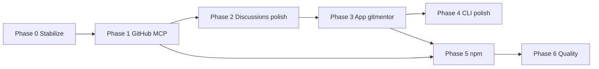

# git-mentor — Roadmap

Evidence-backed GitHub career intelligence. This document sequences work from the current **v0.1** monorepo toward a stable product: CLI, MCP, browser app, and GitHub community workflows (Discussions).

**Current baseline (done):**

| Surface | Location | Notes |
|---------|----------|--------|
| CLI + Ink chat | `packages/cli` | Primary UX; slash commands, model picker, GitHub auth |
| Chat engine | `packages/chat` | Sessions, prompts, GitHub MCP wiring |
| Agents / analysis | `packages/agents` | Profile, repo scans, coaching pipeline |
| GitHub + MCP | `packages/github` | ~26 tools: profile, repos, search, social graph, discussions, writes |
| LLM | `packages/llm` | Ollama, OpenRouter, model config |
| Core config | `packages/core` | `~/.config/git-mentor`, rules, skills |
| Minimal browser UI | `packages/chat/src/server.ts` | `gitmentor app` → localhost:3847, embedded HTML |
| npm global | root `package.json` | `gitmentor` / `git-mentor` binaries |

**Out of scope (removed from roadmap):** Hugging Face Spaces, Hub datasets, and any `apps/space` demo path. Delete or archive `apps/space` when cleaning the monorepo.

---

## Vision

One coaching brain (`@git-mentor/chat` + `@git-mentor/agents`) exposed through:

1. **Terminal** — fast, local-first, power users  
2. **App** — approachable UI for reports, history, and GitHub actions  
3. **MCP** — Cursor / IDE agents with the same tools and evidence rules  
4. **GitHub account control** — authenticated writes (profile, repo files, metadata, pins) with human confirmation  
5. **GitHub Discussions** — list, read, and participate in forum threads (including `community/community`)

All surfaces share config, cache (`~/.local/share/git-mentor/reports/`), rules/skills, and deterministic slash commands where possible.

**Out of scope:** Issues, pull requests, merge/code-review automation, local git clone/deep scan on disk.

**Product principle:** gitmentor acts on **your** GitHub only when `gh auth` matches the coached username; coaching someone else stays read-only.

---

## Phase 0 — Stabilize foundation (short)

**Goal:** Safe to ship `0.2.x` on npm and document the public contract.

- [ ] Raise eval pass rate (`gitmentor eval`) to ≥ 80% consistently; add regression cases for profile vs repo analysis boundaries  
- [ ] Publish checklist: `pnpm build`, `pnpm test`, global install smoke (`gitmentor doctor`, `gitmentor octocat --deterministic`)  
- [ ] Align README with actual MCP tool list (built-in vs `github` server)  
- [ ] Versioning policy: semver for `@git-mentor/*` workspace packages when publishing internally  
- [ ] Remove Hugging Face references from README and repo layout (`apps/space` deprecation note in changelog)  

**Exit criteria:** CI green on main; npm install path documented and verified.

---

## Phase 1 — GitHub MCP surface — **mostly shipped**

**Goal:** Read and write on the authenticated user’s GitHub account via MCP + slash commands — profile, repos, social graph, search, discussions — without issues/PR/merge workflows.

### Shipped

| Layer | Capability |
|-------|------------|
| `packages/github` | REST + GraphQL: profile, repos, commits/branches, following/followers, search, discussions |
| MCP `github` | ~26 tools (see `GITHUB_MCP_SHIPPED_TOOLS` in `mcp-github-tool-definitions.ts`) |
| Writes | `update_user_profile`, `upsert_repository_file`, `update_repository_metadata`, `pin_repositories`, `fork_repository`, `follow_user`, `unfollow_user`, `create_repository` |
| Chat | `/apply bio|readme|pin`, `/followers`, `/following`, `/discussions`, `/discuss create|reply`, `/fork` |
| LLM | Ollama tool loop exposes `github` MCP tools (`mcp-llm-tools.ts`) |

**Auth:** `gitmentor auth login` / `auth refresh` with scopes `user`, `repo` (see `GITMENTOR_GH_SCOPES`).

### Remaining (Phase 1)

- [ ] `push_files` — multi-file commit in one tool  
- [ ] Chat: natural-language “apply this README” → preview + confirm (without manual `/apply`)  
- [ ] Integration tests for MCP write + discussion tools (mocked fetch)  
- [ ] App gitmentor: write preview + Apply button  

**Explicitly not planned:** `create_issue`, `create_pull_request`, merge, code review, local git clone/deep scan.

**Exit criteria:** `tools.md` matches shipped tools; `/followers` vs `/following` never confused in eval.

---

## Phase 2 — GitHub Discussions (forum) — **core shipped**

**Goal:** Coach and act on **GitHub Discussions** — threads on the user’s repositories (and org repos they can access) — for visibility, maintainer presence, and OSS community growth.

GitHub Discussions are **per repository** (not on user profiles). “Linked to our profile” means: discussions on **repos we own or maintain**, optionally filtered by participation, labels/categories, or search.

### 2.1 API layer (`packages/github`)

Prefer **REST** ([Discussions API](https://docs.github.com/en/rest/using-the-rest-api/github-discussions)) with Octokit where possible; use **GraphQL** only if REST gaps block a feature (e.g. some list filters).

| Capability | REST / GraphQL | Notes |
|------------|----------------|--------|
| List discussions for a repo | REST | `GET /repos/{owner}/{repo}/discussions` — requires Discussions enabled on repo |
| Get one discussion | REST | By `discussion_number` |
| List comments on a discussion | REST | Threaded replies via comment endpoints |
| Create discussion | REST | Title, body, category (Q&A, Ideas, General, etc.) |
| Create / update comment | REST | Reply on discussion or on another comment |
| Close / lock discussion | REST | Moderation |
| Discover “my” threads | REST + aggregation | Iterate pinned/owned repos from profile analysis; optional `search` for `author:@me` in discussion bodies |

**Scopes:** `repo` (private repos) or `public_repo` for public-only; document `read:discussion` / classic PAT equivalents and `gh auth refresh` when 403/404.

**Tasks:**

- [x] `packages/github/src/discussions.ts` — GraphQL client + `search_discussions`  
- [ ] Map repos from coaching context → repos with Discussions enabled (auto-skip disabled repos)  
- [ ] Handle repos without Discussions (skip + user-visible hint to enable in repo Settings)  

### 2.2 MCP tools (`mcp-github-server.ts`) — shipped

| Tool | Status |
|------|--------|
| `list_discussions`, `get_discussion`, `list_discussion_comments` | Shipped |
| `create_discussion`, `create_discussion_comment` | Shipped |
| `list_my_discussions`, `search_discussions` | Shipped |
| `update_discussion_comment` | Optional MVP+ |

### 2.3 Chat & coaching

- [x] Slash: `/discussions`, `/discussions <owner/repo>`, `/discussions community`, `/discuss create`, `/discuss reply`  
- [ ] Inject **DISCUSSIONS CONTEXT** into system prompt: open threads, unanswered questions, last activity dates (evidence-only)  
- [ ] Skill `github-discussions-engagement` — when to reply, when to open a new thread, tone for maintainers  
- [ ] Rule snippet: never claim a discussion exists without `list_discussions` / `get_discussion` in context  

**Coaching use cases:**

- Surface stale Q&A on flagship repos  
- Suggest draft replies (user confirms before MCP `create_discussion_comment`)  
- Recommend new discussion categories or pinned guidance posts for OSS credibility  

### 2.4 App gitmentor (preview)

- [ ] Discussions inbox: repo filter, sort by updated, unread-style markers from cached API snapshots  
- [ ] Composer: new discussion / reply with preview → confirm → MCP call  

**Exit criteria:** From chat, user can list discussions on a coached repo, read thread + comments, create a discussion and post a comment via MCP; scopes and errors documented in `tools.md`.

---

## Phase 3 — App gitmentor (`apps/gitmentor`)

**Goal:** Replace the embedded HTML prototype with a first-class web client that reuses `@git-mentor/chat` and matches CLI capabilities (including Discussions inbox from Phase 2).

### 3.1 Architecture

```
apps/gitmentor/          # Vite or Next.js SPA + API routes (or thin BFF)
  └── talks to           @git-mentor/chat (session API)
                         @git-mentor/core (config)
                         optional: same HTTP server as today, extended routes
```

**Decision (recommended):** Keep a **single Node HTTP server** owned by `@git-mentor/chat/server` (or `apps/gitmentor/server`) so `gitmentor app` stays one command; the SPA is static assets served by that server. Avoid duplicating session logic in the frontend.

### 3.2 MVP features (parity with CLI chat)

- [ ] Session start: username, target role, welcome + context stats  
- [ ] Message stream (SSE or WebSocket) for LLM replies  
- [ ] Slash command palette or sidebar: `/analyze profile`, `/analyze <repo>`, `/role`, `/gaps`, `/export`, `/help`  
- [ ] Report viewer: render cached dossier from `~/.local/share/git-mentor/reports/<user>.md`  
- [ ] Settings panel: model provider, `cacheTtlHours`, read-only view of active rules/skills  

### 3.3 MVP+ (differentiators vs terminal)

- [ ] GitHub auth status + link to `auth login` flow (or instructions + deep link to `gh`)  
- [ ] Trending / follow UI: table of suggested profiles/repos with one-click MCP actions (when scopes allow)  
- [ ] **Discussions panel** (Phase 2): browse, reply, create — same MCP backend  
- [ ] Dark/light theme aligned with GitHub-like tokens (current embedded UI is dark-only)  
- [ ] Mobile-friendly layout (terminal chat is not)  

### 3.4 Packaging

- [ ] `gitmentor app` opens browser and serves `apps/gitmentor` build output  
- [ ] `pnpm --filter @git-mentor/app dev` for local frontend dev with HMR  
- [ ] Optional: `gitmentor app --open` flag (default true)  

**Exit criteria:** A non-developer can coach a public profile end-to-end in the browser without using Ink; reports persist to the same cache path as CLI.

---

## Phase 4 — CLI and chat UX polish

**Goal:** Terminal remains the best surface for daily use.

- [ ] Context window indicator + `/export` improvements (markdown + JSON bundle)  
- [ ] Richer `/improve` flow tied to `profile-improvement` agent output  
- [ ] Repo deep-scan progress in Ink (spinner + partial results)  
- [ ] `gitmentor init` wizard: provider, model, rules/skills, MCP server snippet for Cursor  
- [ ] i18n decision: keep coaching output English-only unless config adds `locale`  

**Exit criteria:** Documented “day in the life” flow in README: init → auth → chat → export report.

---

## Phase 5 — Distribution (npm)

**Goal:** Reliable installs and releases — no third-party demo host.

- [ ] Automated release (tag → build → `npm publish` for `git-mentor` package)  
- [ ] Changelog from conventional commits or manual `CHANGELOG.md`  
- [ ] Postinstall story verified on Linux/macOS/Windows (Node 20+)  
- [ ] Optional: static marketing site or docs site (not HF) linking to `npm install -g git-mentor`  

**Exit criteria:** `npm install -g git-mentor` on latest tag; README install path matches CI artifacts.

---

## Phase 6 — Quality, observability, and ecosystem

**Goal:** Trust for career advice (evidence-backed positioning).

- [ ] Expand synthetic eval dataset (`packages/cli/src/datasets/synthetic_profiles.json`)  
- [ ] Property tests: “no manifest claims without repo scan”; “no discussion claims without list/get in context”  
- [ ] Optional telemetry (opt-in): command usage, eval scores, no profile or discussion body content  
- [ ] Community skills pack: template repo `.git-mentor/skills` for teams  
- [ ] Cursor / VS Code extension (thin): spawn `gitmentor mcp` + docs — only if demand  

**Exit criteria:** Eval pass rate ≥ 90%; documented evidence policy for contributors.

---

## Suggested order of execution



| Priority | Phase | Effort (rough) | User-visible win |
|----------|-------|----------------|------------------|
| P0 | Foundation | S | Reliable installs |
| P1 | GitHub MCP | M | Profile, social, search, discussions (shipped) |
| P2 | Discussions coaching | S–M | Prompt context, skills, aggregation caps |
| P3 | **App gitmentor** | L | Browser product + discussions inbox |
| P4 | CLI polish | M | Power-user retention |
| P5 | npm releases | S | Distribution |
| P6 | Quality | M | Credibility |

**Product scope (2026-06-03):** no issues/PR/merge, no local git clone or disk deep scan.

---

## Monorepo target layout (end state)

```
packages/
  core · github · llm · agents · chat · cli
apps/
  gitmentor/     # Web UI (Phase 3)
```

`packages/chat` remains the **single source of truth** for session lifecycle; `apps/gitmentor` is presentation + routing only.

`packages/github` owns **all** GitHub REST/MCP integrations (profile, repos, social, search, **discussions**).

`packages/git-local` exists in the monorepo but is **not** wired into the product (no npm bundle, no init registration).

---

## Open decisions (resolve before Phase 3 build)

1. **Framework:** Vite + React (align with Ink/React skills) vs Next.js (if SSR/marketing pages needed).  
2. **Auth in browser:** subprocess `gh auth login` vs OAuth app vs “CLI-only auth, app read-only until token file exists”.  
3. **Hosted app:** stay localhost-only vs optional public deployment (secrets, GitHub OAuth).  
4. **LLM in browser:** never embed API keys; proxy via local server only (same as today).  
5. **Discussions aggregation:** cap repos scanned per `/discussions` (e.g. top 10 pinned) to respect rate limits.  
6. **Human-in-the-loop:** require explicit confirmation before every `create_discussion` / `create_discussion_comment` (default on).  

---

## Success metrics

| Metric | Target |
|--------|--------|
| `gitmentor eval` pass rate | ≥ 90% (Phase 6) |
| npm weekly installs | Track after Phase 5 |
| App session completion | User reaches exported report after `/analyze profile` |
| MCP tool coverage | Documented `github` tools implemented (including discussions) |
| Discussion engagement | User lists + replies on ≥1 repo without leaving gitmentor |
| Time-to-first-coach | &lt; 5 min from `npm i -g` + `init` + `app` |

---

## References

- [README.md](./README.md) — install, chat commands, MCP config  
- [packages/cli/templates/agent/mcp/tools.md](./packages/cli/templates/agent/mcp/tools.md) — MCP tool catalog (generated on `gitmentor init`)  
- [GitHub REST — Discussions](https://docs.github.com/en/rest/using-the-rest-api/github-discussions)  

*Last updated: 2026-06-03 — MCP github ~26 tools; no issues/PR/git-local in product.*
