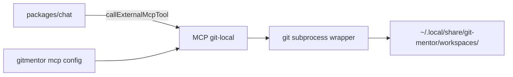

# Git-local MCP — design spec

**Status:** Draft — priority **C** (first implementation track)  
**Date:** 2026-06-03  
**Scope:** Local git operations for git-mentor (clone, pull, inspect) via a dedicated MCP server, isolated from GitHub REST writes.

---

## 1. Problem

Today git-mentor can **fork** a repo via GitHub MCP and coach from **API metadata** (`/analyze`, agents). It cannot:

- Clone a fork or upstream repo into a controlled directory
- Pull latest changes
- Inspect branch, status, recent commits, or diff stats **on disk**
- Feed local tree context into repo analysis (manifests, structure) without manual `git clone`

Users chose **priority C** before platform MCP (issues/PRs) and Discussions.

---

## 2. Goals

| Goal | Measure |
|------|---------|
| Clone a repo (HTTPS) into a git-mentor workspace | `git_clone` succeeds; path returned |
| Update an existing workspace | `git_pull` |
| Read-only inspection | `git_status`, `git_log`, `git_branch_list`, `git_diff_stat` |
| Chat + Ollama tool calling | Same pattern as `github` MCP (stdio server, config entry) |
| Safe paths | No arbitrary shell; all paths under `WORKSPACES_DIR` |
| Docs | `tools.md` section + skill `git-local-workspace` |

## 3. Non-goals (this spec)

- `git push`, force push, or credential writing
- SSH remotes (HTTPS only in v1; SSH optional later)
- Replacing `@git-mentor/agents` repo scan — **integrate** after clone (call existing `analyze_repository` on workspace path in a follow-up task)
- GitHub Discussions or Community forum
- Bundling git binary — require `git` on `PATH` (document in `gitmentor doctor`)

---

## 4. Architecture



**New package:** `packages/git-local` (or `packages/git` — prefer **`git-local`** to avoid npm name clash).

| Module | Responsibility |
|--------|----------------|
| `workspace-path.ts` | Resolve `owner/repo` → absolute path; reject path traversal |
| `git-runner.ts` | Spawn `git` with fixed args, timeout, max output size |
| `operations.ts` | clone, pull, status, log, branch, diff --stat |
| `mcp-git-local-server.ts` | MCP stdio server (mirror `mcp-github-server.ts`) |
| `mcp-handlers.ts` | Tool definitions + dispatch |
| `mcp-setup.ts` | `GIT_LOCAL_MCP_SERVER_NAME`, default server entry, shipped tool list |

**Config (`@git-mentor/core`):**

```ts
export const WORKSPACES_DIR = path.join(DATA_DIR, "workspaces");
```

Extend `ensureDirs()` to create `WORKSPACES_DIR`.

**MCP server entry (auto on `gitmentor init` / start when `git` available):**

```yaml
- name: git-local
  command: node
  args: ["…/mcp-git-local-server.js"]
  enabled: true
```

---

## 5. Workspace layout

```
~/.local/share/git-mentor/workspaces/
  {owner}/
    {repo}/          # single clone root (one remote default)
      .git/
      …
```

- **Key:** `owner` + `repo` from GitHub URL or `owner/repo` string.
- **Collision:** If directory exists and is a git repo → `git_pull` / status; if not a repo → error with hint to remove or use `force: true` on clone (optional arg, default false).
- **Disk cap (v1):** Refuse clone if shallow clone still exceeds **500 MB** after clone (check `du` or post-clone size); document limit. Optional `--depth 1` default for trend/fork flows.

---

## 6. MCP tools (v1)

| Tool | Args | Behavior |
|------|------|----------|
| `git_clone` | `owner`, `repo`, optional `remote_url`, `branch`, `depth` (number), `force` (bool) | `git clone [--depth N] [--branch B] URL workspacePath` |
| `git_pull` | `owner`, `repo` | `git -C path pull --ff-only` |
| `git_status` | `owner`, `repo` | Porcelain + branch tracking |
| `git_log` | `owner`, `repo`, `max_count` (default 20) | `git log --oneline -n N` |
| `git_branch_list` | `owner`, `repo` | Local + remote branches (short) |
| `git_diff_stat` | `owner`, `repo`, optional `base`, `head` | `git diff --stat base..head` or unstaged |
| `list_workspaces` | — | JSON list of cached `owner/repo`, path, last modified |

**Default clone URL:** `https://github.com/{owner}/{repo}.git`  
**Override:** `remote_url` for forks (`https://github.com/{user}/{repo}.git`).

**Return shape:** JSON `{ ok, path, stdout, stderr?, summary }` — same text JSON pattern as GitHub MCP.

---

## 7. Security

1. **Path jail:** Resolved path must satisfy `path.resolve(path).startsWith(WORKSPACES_DIR + sep)`.
2. **No user-supplied paths** in v1 — only `owner` + `repo` alphanumeric/`._-`.
3. **Subprocess:** `git` only; argv allowlist per operation; no `shell: true`.
4. **Timeout:** 120s clone, 60s other ops.
5. **Output cap:** Truncate stdout/stderr to 64 KB in MCP response.
6. **Secrets:** Never pass tokens on clone URL; public HTTPS only in v1 (private repos need credential helper already configured on the machine — out of scope, document limitation).

---

## 8. Chat integration

### 8.1 Slash commands

| Command | Maps to |
|---------|---------|
| `/clone owner/repo` | `git_clone` |
| `/clone owner/repo --depth 1` | shallow clone |
| `/pull owner/repo` | `git_pull` |
| `/workspace` | `list_workspaces` |
| `/workspace owner/repo` | status + last 5 log lines |

### 8.2 Ollama tool calling

- New `gitLocalToolsForLlm()` in `packages/chat` (mirror `github-llm-tools.ts`).
- Enable when: Ollama + `git-local` MCP enabled + **no** requirement to match session user (local git is not account write).
- `executeTool` → `callExternalMcpTool(config, "git-local", name, args)`.

### 8.3 Coaching flows

- After `/fork`, suggest: `/clone youruser/repo` then `/analyze owner/repo` (future: pass workspace path to agents).
- Skill **`git-local-workspace`**: when to clone vs stay API-only; never push from git-mentor.

---

## 9. CLI & bootstrap

- `gitmentor doctor`: check `git --version` on PATH.
- `bootstrapAgentAssets` / `ensureGitLocalMcpServer(config)`: register server if `git` exists.
- Regenerate `tools.md` with § **git-local** (extend `mcp-tools-reference.ts`).

---

## 10. Implementation order (within track C)

1. `packages/git-local` + `git_runner` + workspace paths + unit tests (mocked `git`)
2. MCP server + handlers + `mcp-setup` exports
3. Config: `WORKSPACES_DIR`, auto-register MCP server
4. Chat: `callExternalMcpTool` already generic — wire slash commands
5. Ollama tool loop for git-local (optional same PR or +1)
6. `mcp-tools-reference` + skill + rule snippet
7. README + PLAN checklist

**Follow-up (track C.2):** `analyze_repository` accepts optional `workspacePath` to run manifest scan on cloned tree.

---

## 11. Testing

| Layer | Tests |
|-------|-------|
| `workspace-path` | Traversal rejection, normalization |
| `git-runner` | Mock `execFile` — argv and cwd |
| MCP handlers | Unknown tool, missing repo |
| Integration (optional CI) | Skip if no git; local smoke script in `scripts/` |

---

## 12. Open questions (defaults chosen)

| Question | Default |
|----------|---------|
| Shallow clone by default? | **Yes** `depth: 1` unless user passes `depth: 0` or omits for full clone |
| Package name | `packages/git-local` |
| Separate MCP server vs extend `github` | **Separate** `git-local` server (hybrid architecture C) |

---

## 13. Success criteria

- From chat: `/clone octocat/Hello-World` → workspace exists; `/pull` updates; `/workspace` lists it.
- Model can call `git_clone` via Ollama when MCP enabled.
- `tools.md` documents all git-local tools; `gitmentor doctor` warns if git missing.
- No path escape in security tests.

---

## References

- [PLAN.md](../../../PLAN.md) — reprioritized with Phase 1c Git local
- [packages/github/src/mcp-github-server.ts](../../../packages/github/src/mcp-github-server.ts) — MCP pattern
- [packages/chat/src/github-llm-tools.ts](../../../packages/chat/src/github-llm-tools.ts) — Ollama wiring
